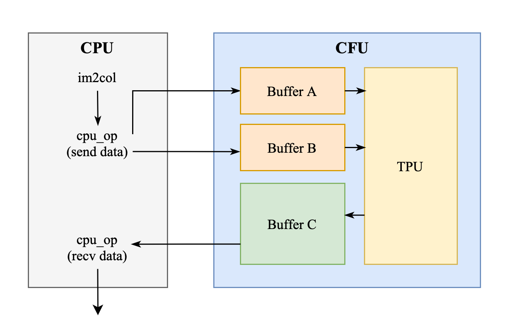

# Lab 5 : Systolic Array with im2col for Convolution

## Goal of this lab
---
- [Integrate Systolic Array to CFU Playground and Run Matmul - X%](#integrate-systolic-array-to-cfu-playground-and-run-matmul-x)
- [Questions in the Demo - 10%](#questions-in-the-demo-10)

## Introduction
---
After finishing lab 3, the implementation of systolic array, we are going to integrate it into the CFU playground. As lab 3 focuses on the design of the circuit, in this lab, you will attempt to do SW-HW co-design to leverage your circuit for accelerating real-world applications.

To successfully integrate your systolic array into CFU-Playground, several modifications are required to make your design synthesizable and meet the necessary constraints. Additionally, you will develop a set of CFU operations that enable efficient communication between the CPU and the TPU for controlling your hardware.

Since the systolic array is designed for matrix multiplication, a technique known as im2col is essential to adapt it for accelerating 2D convolution operations by converting convolutions into matrix multiplications. You'll also need to implement it in this lab.

## Integrate Systolic Array to CFU Playground and Run Matmul - X%
---

The matrix data needs to be transmitted from the CPU to the global buffers A and B in the CFU. Once all the required data has been gathered, then the TPU will start to compute this matrix data. The outcome of the computation will be preserved in the buffer C. Finally, the data stored in the buffer C will be written back to the CPU.



### Deal with Signed int8 - x%

The key word spotting model we intend to accelerate uses int8, and since negative values occur during computation, we need to modify it to support operations with signed integers.

After finishing the modification, use the below command under the lab 3 directory `AAML2024-Lab3/` to make sure it can deal with int8 correctly.
```
$ make verif_signed
```
The pattern generator will generate 50 sets of two 16*16 matrix using int8 ∈ [-128, 128) and pass it to your systolic array and check the answers.


### Intergration and Verification - x%

Now you are ready to do the intergration! Create a new project folder just like previous labs.

As shown in the block diagram, we will also be intergrating global buffer A, B and C into the CFU, we have provide a global buffer design that uses the BRAM resources of the FPGA, please mind that this buffer does not have an async reset.

Since Vivado will utilize a lot of flip flops when synthesizing original lab 3 buffer, so make sure you have replace it, otherwise you may run into timing and utilization issues.
```{important}
Click [here](https://github.com/gnkre/lab5_from_hell/blob/master/e_lab3/global_buffer.v) for the global buffer using BRAM and the TPU example that instantiates it.

It's totally fine if you want to use something else instead of using this BRAM buffer and example, as long as you can integrate your systolic array to into the CFU and pass the tests.
```

After all the hardware coding and designing the `cfu_op` to pass and recieve data from your accelerator, it is nice to do some verification now, we have provide a test before you really dive into the complicated inferencing of the KWS model.

1. Run this command under the project directory to wget the golden test `functional_cfu_tests.cc` to your project
```
$ wget -P src/ https://github.com/gnkre/lab5_from_hell/raw/master/src/functional_cfu_tests.cc
```

2. `make clean`, `make prog EXTRA_LITEX_ARGS="--cpu-variant=perf+cfu"`, `make load` and enter `2: Functional CFU Tests` from the main menu, it shall look something like this:

```
Tests for Functional CFUs
=========================
 h: Matmul 16*16 int8 w/ pattern 1
 e: Matmul 16*16 int8 w/ pattern 2
 l: Matmul 16*16 int8 w/ pattern 3
 p: Matmul 16*16 int8 w/ pattern 4
 !: Matmul 16*16 int8 4096 times w/ 4 patterns rotating
 x: eXit to previous menu
```
`make clean` then `make prog EXTRA_LITEX_ARGS="--cpu-variant=perf+cfu"` if you don't see it.

3. Write the code about passing and recieving data to your accelerator from the software side in the `do_matmul_num` function of the `functional_cfu_tests.cc`.
```{important}
- All the pattern we use to test are 16*16 int8, that is, the M, N, K are all 16.
- The input layout are just like lab3, you may checkout the details in the comment of `functional_cfu_tests.cc`.
- For the output, you are required to place it to a row-major 1-D matrix.
- We are using the `perf_counter` here, so make sure you `make prog EXTRA_LITEX_ARGS="--cpu-variant=perf+cfu"`.
- Or you might get stuck running patterns because you don't have the `perf_counters` enabled.
```

```c
void do_matmul_num(int test_num) {
  // place your answer in this array!
  uint32_t C_arr[256];

  // =====================================================
  // Implement your design here, 
  // and DO NOT MODIFY ANYTHING "ABOVE" THIS LINE !!
  // ===================================================== 

  /**
    1. Pass data to CFU.
    2. Pass matrix parameters to CFU.
    3. Receive data from CFU and place it to `C_arr`.
  */ 

  // =====================================================
  // DO NOT MODIFY ANYTHING "BELOW" THIS LINE !!
  // =====================================================

  for (uint32_t i = 0; i < 256; i++) {
    if (C_arr[i] != C_arr_ans[test_num][i]) {
      error_ct++;
      printf("*** %ld error(s) @ pattern no. %d\n ---> golden C_arr[%02ld][%02ld] = %08lX, your C_arr[%02ld][%02ld] = %08lX\n", 
        error_ct, test_num, i>>4, i&0xF, C_arr_ans[test_num][i], i>>4, i&0xF, C_arr[i]);
    }
  }
```
```{important} 
You will get **0%** if you can't pass the golden test or did't meet the requirement.
```

| Passes pattern       | Pattern 1 | Pattern 2 | Patten 3 | Pattern 4 | 4096 times 1-4|
| -------------------  | --------- | --------- |:-------- |:--------- | ------------- |
| cycle ct. requirement|  < 25M    | < 25M     |  < 25M   |  < 25M    |  < 60M        |
| Score                |         X |         X |        X |         X |             X |


## Questions in the Demo - 10%
---
You will be asked several questions about the concepts covered in this lab and your implementation. This section accounts for 10% of the total lab score.


## Submission
---
You need to hand in your **CFU-Playground project folder** without the `build` folder and renamed with your student ID. 

Please organize your submission files into a zip archive structured as follows:
```
YourID.zip
    └── YourID/
        ├── src/
        │    ├── folder... 
        │    └── files...
        ├── cfu.v
        └── Makefile
```

```{important}
TAs should be able to run your project without any modification. If TAs cannot compile or run your code, **you won't receive any points, even if you passed the DEMO**. Also, **PLAGIARISM is not allowed**.
```
